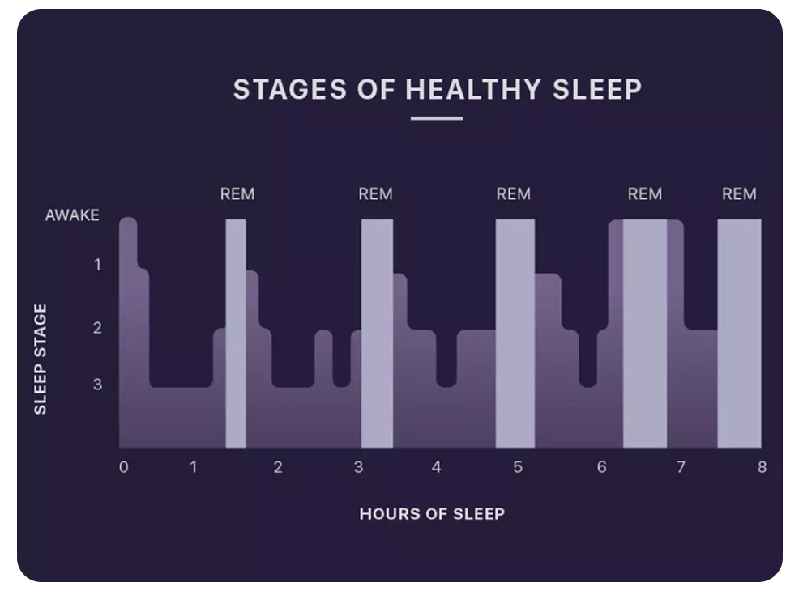
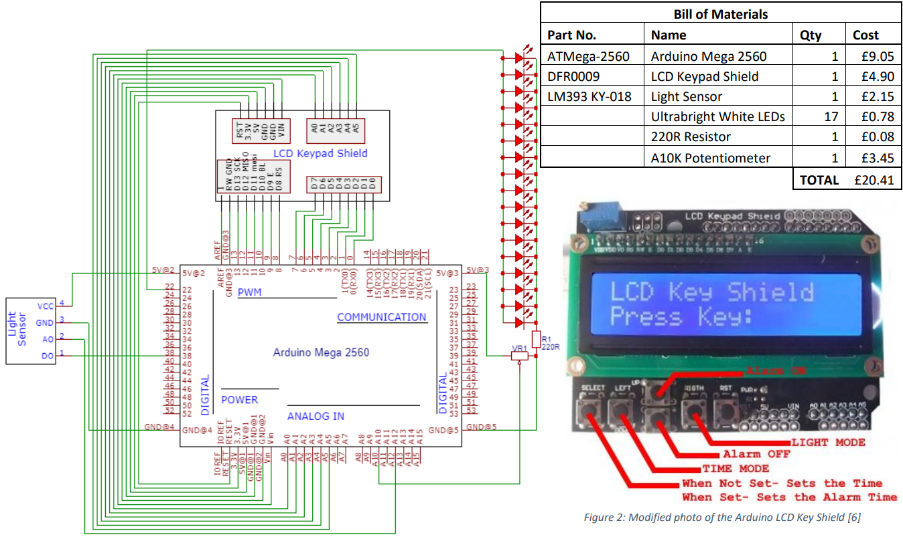
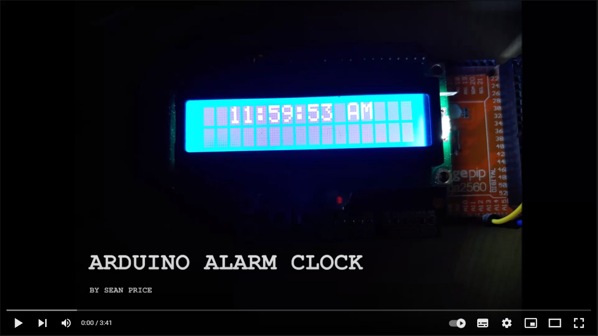

# Arduino Sunrise Alarm Clock

## Table of Contents
- [Introduction](#introduction)
- [Brief](#brief)
- [Circuitry](#circuitry)
- [Code](#code)
- [Case](#case)
- [Demonstration](#demonstration)
- [Further Work](#further-work)
- [References](#references)

## Introduction

I started this project during my first year at university and I aim to continue adding to it.

## Brief

I often wake up and feel like I am not refreshed. After researching this, I found that my alarm clock is forcing me to wake up from either deep sleep or REM [1]. When in the light sleep stage, our circadian rhythm causes us to naturally wake up if it is light [2]. Waking up naturally like this leaves you feeling energised and refreshed [1]. My alarm system is designed to wake me up naturally, with light, to help me feel less fatigued.

 

*Figure 1: A graph to show sleep cycles [3]*

## Circuitry

## Code

The code is loosely based on two pieces of open-source code which taught me how to create an accurate clock and interface with the LCD keypad shield. [4] [5] 

## Case

In the future I plan to design an enclosure for this project.

## Demonstration

## Further Work

In the future I plan to add;

- An RTC Module to make the clock more accurate
- A wireless light sensor module which can sit on the windowsill and communicate the outdoor light level with the clock.
- A backup audio alarm to ensure that I do wake up on time.
- The ability to connect a SAD therapy light, which simulates natural sunlight. 
- A module with a stepper motor to open the curtains and let the sunlight in when the alarm goes off.
- An enclosure for this project
- More intelligent modules which can connect to the internet and read the weather forecast or schedule for the day.

## References

| [1]  | A. Collins, "Why you are waking up tired (and what you  can do about it)," [Online]. Available:  https://www.opencolleges.edu.au/blog/2016/08/06/lw-why-you-are-waking-up-tired-and-what-you-can-do-about-it/?__cf_chl_captcha_tk__=aa91fb513300b79120ddf1f1bd380a74a902a760-1608421831-0-AdtuxG3awSAYjQVxhJbdHM_abPf6KA0zccXVG55Zhf14AK3OFOV59ab4r-fyT_eMYyhb5_. |
| ---- | ------------------------------------------------------------ |
| [2]  | R. Foster, "Light and the circadian rhythm: The key to a good night's sleep?," 18th May 2019. [Online]. Available:  https://www.bbc.co.uk/news/health-48268110. |
| [3]  | "How Sleep Works," 20th Apr 2020. [Online].  Available: https://pzizz.com/blog/science/how-sleep-works/. |
| [4]  | "Simplest UNO Digital Clock Ever," 18th Nov 2018.  [Online]. Available:  https://create.arduino.cc/projecthub/plouc68000/simplest-uno-digital-clock-ever-4613aa. |
| [5]  | "Using 1602 LCD Keypad Shield w/ Arduino," 26th  Apr 2019. [Online]. Available:  https://create.arduino.cc/projecthub/electropeak/using-1602-lcd-keypad-shield-w-arduino-w-examples-e02d95. |
| [6]  | "LCD Keypad Shield for Arduino," [Online].  Available: https://www.hobbytronics.co.uk/arduino-lcd-keypad-shield. |